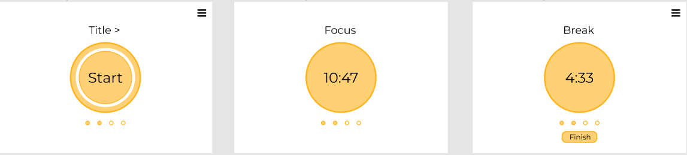

# Design Notes Related

Document to capture all the design decisions made and why.

## Meeting 01/31/2021
### Must have
- Decision: The *title* will say "Focus" during the 25 minutes timer and "Break" during the break session
- Reason: Keep the look minimalist, if the title would represent the current task studying (like "math studying", etc.) it will require more configuration on the user side, which we want to avoid, plus we believe that with time the user won't change the title (laziness).

- Decision: First time loading the website the "main" button would say *Start*; after it has been clicked it will change to present the counter (25:00 counting down)
- Reason: 1) We want to avoid having too many buttons and displays. 2) We want to inform the users how long they have until the next break.

- Decision: When the timer reaches 00:00 there will be a notification sound. We'll use two different sounds, one to indicate the focus session is over, one to indicate the break session is over.
- Reason: The reason for sound notification is to grab the user's attention (they hopefully won't be looking at the count down the entire time). The reason for the two different sounds is the associate which "mode" you enter to (focus/ break).

- Decision: The *stop* option will be presented only during the breaks.
- Reason: Once started a Pomodoro it should be stopped. If this is the user's last task (they don't need more pomodoros) they could stop it at the end.

- Decision: The settings button will not be visible during the focus sessions.
- Reason: During the focus time the user should interact with the website to (re)config the settings. They should do it before starting/ during breaks.

- Decision: The general layout and default color will be as follow bellow
- Reason: The yellowish/ orange color feels fresh motivating, and the minimalist design should be intuitive and simple for the user to do exactly what they need to do, focus on their important tasks.

### Nice to have
- Have an option (feature) for the user to decide if they want to see the count down, or hide it from them.
- The circle can start full and slowly drain while time passes